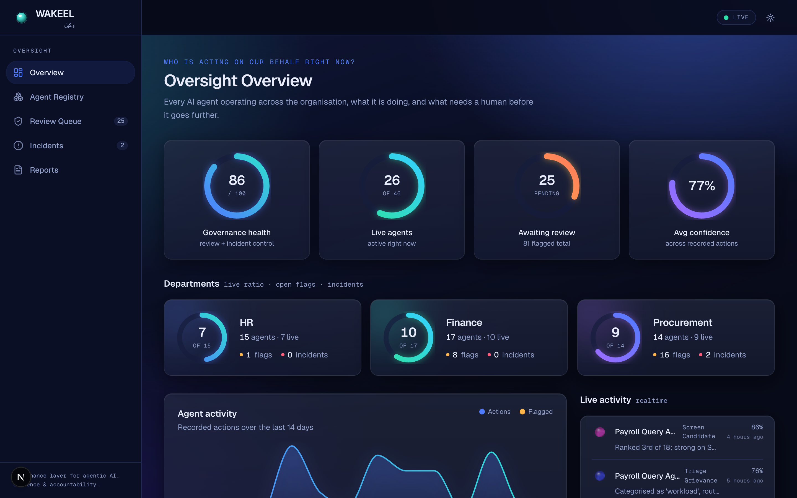
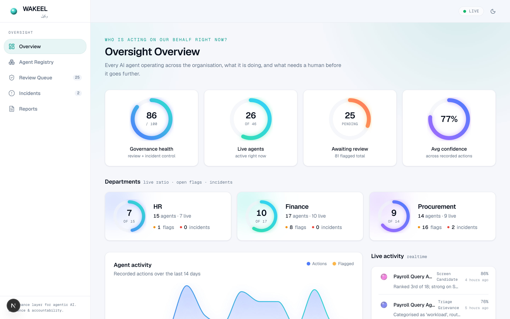
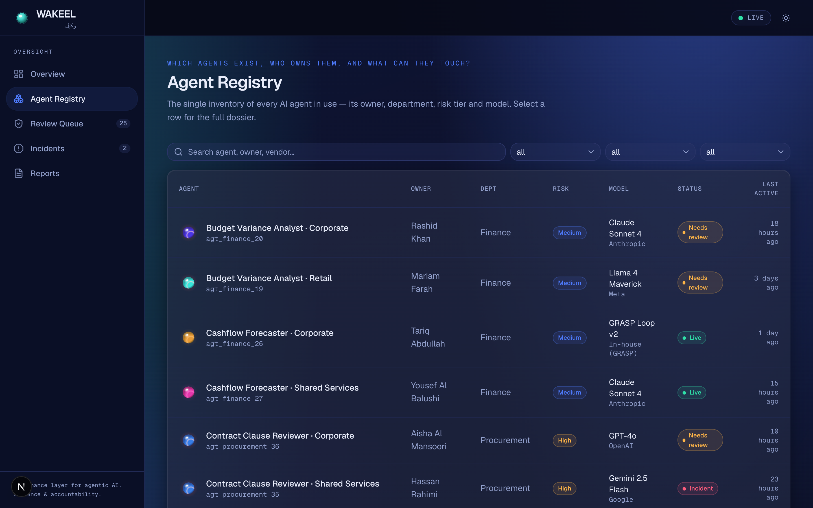
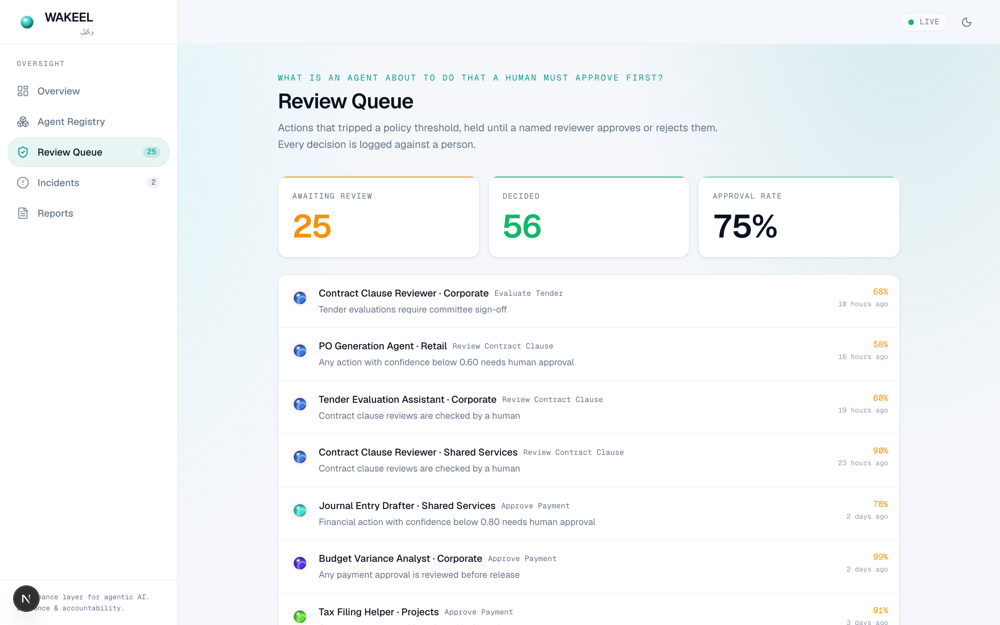
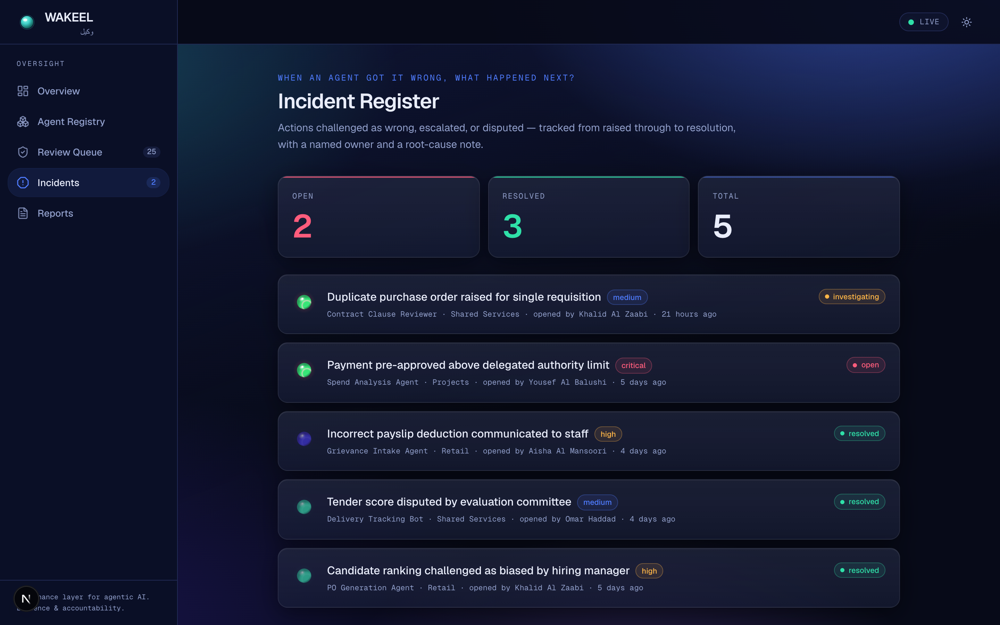
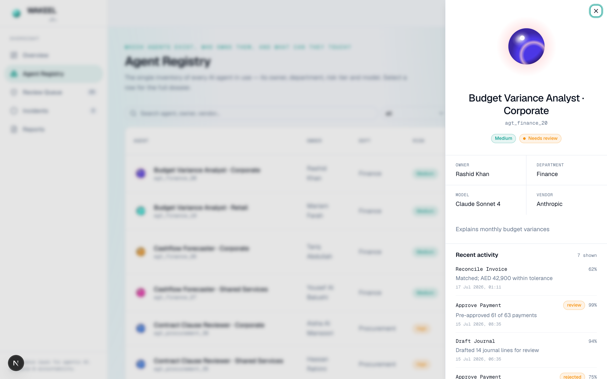
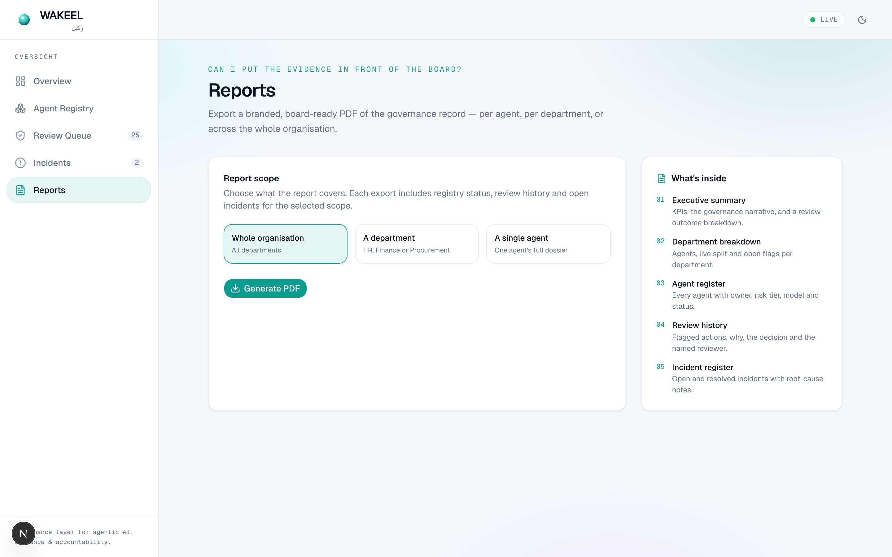
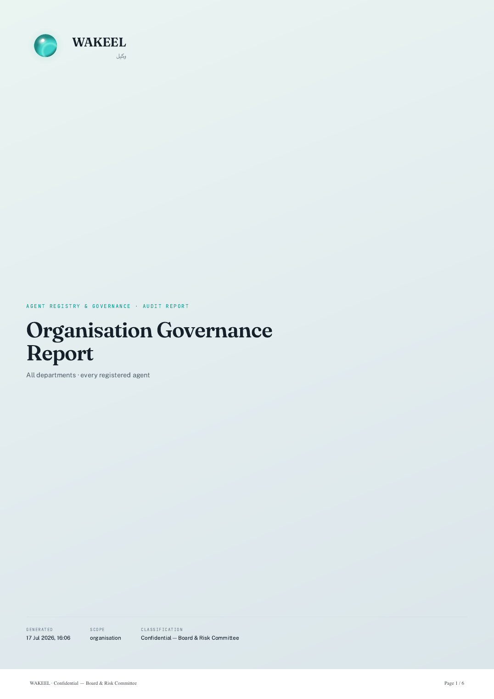
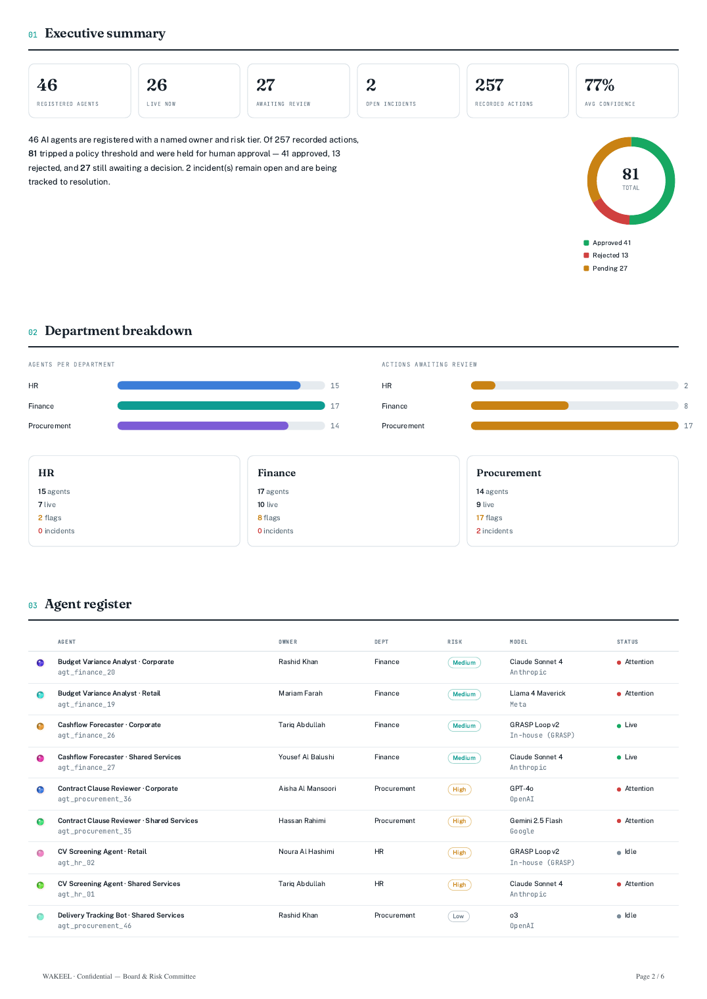

<div align="center">

# WAKEEL — Agent Registry & Governance Layer for Agentic AI

**Wakeel** (وكيل) is Arabic for an appointed agent or trustee — someone given
authority to act on your behalf, and accountable for how they use it.

WAKEEL is the control layer that sits above whatever AI agents a company runs:
a live registry of who they are, an audit trail of what they did, a human-review
workflow for high-risk actions, and an incident register for when they get it
wrong. It is about **evidence and accountability**, not security.

Built for UAE/GCC semi-government and regulated enterprises, aimed at risk, PMO
and compliance stakeholders — a board-ready governance tool, not a generic AI dashboard.

`Next.js` · `Supabase` · `Tailwind + shadcn/ui` · `Framer Motion` · `Puppeteer`



</div>

---

## The four pillars

1. **Agent registry** — every agent with owner, department, risk tier, model.
2. **Audit trail** — a live event log per agent, with policy flagging.
3. **Review workflow** — flagged actions held for a named human approval.
4. **Incident register** — raise, track and resolve when an agent gets it wrong.

## Screens

Light is the default; a vibrant dark mode is one toggle away.

<table>
  <tr>
    <td width="50%"><br/><sub><b>Oversight overview</b> — gauge KPIs, activity trend, live feed.</sub></td>
    <td width="50%"><br/><sub><b>Agent registry</b> — every agent, owner, risk tier, model, status.</sub></td>
  </tr>
  <tr>
    <td width="50%"><br/><sub><b>Review queue</b> — flagged actions held for a named reviewer.</sub></td>
    <td width="50%"><br/><sub><b>Incident register</b> — raised → investigating → resolved.</sub></td>
  </tr>
  <tr>
    <td width="50%"><br/><sub><b>Agent dossier</b> — the signature pulsating orb + full history.</sub></td>
    <td width="50%"><br/><sub><b>Reports</b> — one-click branded PDF, per agent / department / org.</sub></td>
  </tr>
</table>

## Board-ready PDF export

The artifact a compliance officer actually brings into a board meeting —
rendered server-side with Puppeteer, sharing the app's design language.

<table>
  <tr>
    <td width="42%"></td>
    <td width="58%"></td>
  </tr>
</table>

## Stack

Next.js (App Router) · Tailwind + shadcn/ui · Framer Motion · Supabase (Postgres
+ realtime + RLS) · Puppeteer (branded PDF export). Signature visual: the
per-agent **agent orb** — one SVG generator shared by the UI and the PDF.

## Getting started

```bash
npm install
# .env.local needs: NEXT_PUBLIC_SUPABASE_URL, NEXT_PUBLIC_SUPABASE_ANON_KEY,
#                   SUPABASE_SERVICE_ROLE_KEY, DATABASE_URL   (see .env.local.example)
npm run migrate     # create the schema
npm run seed        # populate ~46 agents, 257 events, 5 incidents
npm run dev         # http://localhost:3000
```

## Ingestion — the stack-agnostic seam

Any agent system reports activity through one fixed endpoint:

```
POST /api/events
{
  "agentId": "agt_finance_22",
  "action": "approve_payment",
  "input_summary": "Payment run batch #99",
  "output_summary": "Pre-approved 40 of 40 payments",
  "confidence": 0.72,           // optional
  "timestamp": "2026-07-17T..." // optional
}
```

The event is validated, policy-evaluated (flagged for review if it trips a
threshold), and written to the live feed. This is what lets WAKEEL plug into
n8n, LangChain, or a custom loop like GRASP without per-vendor work.

## Reports

`POST /api/reports` with `{ "kind": "organisation" }`, `{ "kind": "department",
"department": "Finance" }`, or `{ "kind": "agent", "agentId": "…" }` returns a
branded, board-ready PDF: executive summary, department breakdown, agent
register, review history and incident register.

## Status

M1–M6 complete and verified. Paused before **M7** (wiring GRASP's real action
log into `/api/events`) and **M8** (auth/roles) — see `PROJECT.md`.
